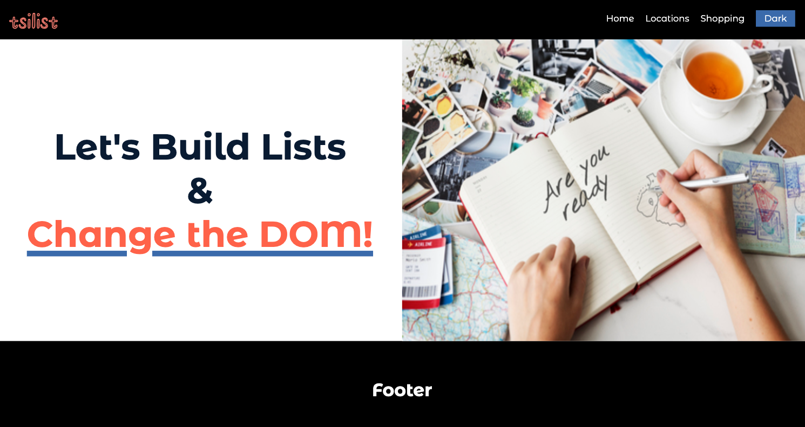
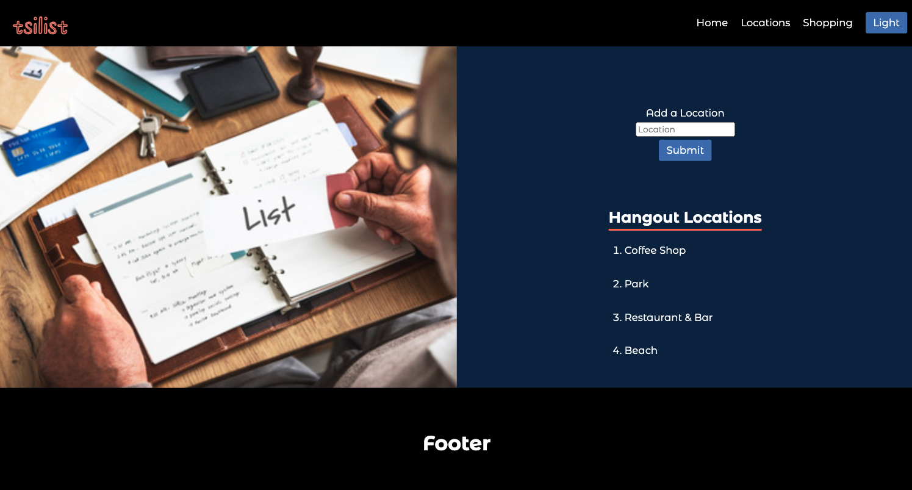

<a name="readme-top"></a>

<!-- PROJECT LOGO -->
<div align="center">
  <a href="">
    
  </a>
<h1 align="center">The DOM & User Interactions</h1>
<h3>Get hands-on practice using forms and buttons with event listeners to add interactivity and improve the user experience</h3>
</div>
<div align="center">
  <h3>
    <a href="#getting-started" target="_blank" rel="noreferrer noopener">Get Started</a>
  </h3>
</div>

<!-- SCREENSHOT -->
<h2 align="center">Screenshots</h2>

<div align="center">
  
  
  <h2 align="center"></h2>
</div>

<div align="center">
  
  
  <h2 align="center"></h2>
</div>

<div align="center">
  
  
  <h2 align="center"></h2>
</div>

## Built With

[](https://html.com/html5/) [](https://www.w3schools.com/css/default.asp) [](https://ecma-international.org/publications-and-standards/standards/ecma-262/)

<!-- GETTING STARTED -->

## Getting Started

To complete the challenges and build this project you'll need a basic understanding of JavaScript. You can start by completing the #100Devs [JavaScript Basics: Classes 12-14](https://communitytaught.org/class/learn-javascript) courses.

You can [download the project](https://github.com/RjayBrown/javascript-dom-intro/archive/refs/heads/main.zip) or fork and [run the project locally](https://github.com/RjayBrown/javascript-dom-intro#fork--run-locally) to get hands-on practice with the core concepts below. Start with reviewing the code and comments for each file in the practice folder.


### Core Concepts

- HTML: Ordered & Unordered Lists
- CSS: Page Themes & Navigation
- JavaScript: DOM Elements & Event Listeners
- Forms: Validating User Inputs

### Hands-On Practice

**1.** Try adding hover styles to the navigation links.

**2.** Since the navigation menu is too wide for mobile devices, you will need to build a working mobile menu.

**3.** Build an input field allowing the user to add items to each list. The input should only contain text. If the input is not valid, display an error message to the user.

**4.** For an extra challenge, try building a button that toggles the page theme from light to dark (as pictured in the screenshots). There is a hint in the comments to point you in the right direction, you'll need to use your resources and searching skills to figure it out! 

## Build a Mini-Project

Once you complete the courses and challenges you'll have the skills to build a basic landing page featuring a sign-up form offering free trials to your potential customers!!! Have fun, be creative, and think of any product or service you like! You can use any of the Canva designs [here](https://www.canva.com/website-builder/templates/landing-page/) for inspiration. Your site can be a single page or multiple pages, but it should have at least a light/dark theme and display a helpful error message if the user's input is not valid. The starter files are in the practice folder.

If you run into trouble, you can reach out in the [[🕒 catchup-crew]](https://discord.com/channels/735923219315425401/932892279637700658) or [[❓code-help]](https://discord.com/channels/735923219315425401/735925942559440997) channels in the #100Devs Discord. It's an amazing community space filled with supportive developers happy to answer any questions you may have!

## Fork & Run Locally

**1.** To get started, open this [link](https://github.com/RjayBrown/javascript-dom-intro/fork) in a new tab to fork or make a personal copy of this repository

  - _**NOTE:** You may find it easier to keep the same name, but you can change it if you like!_

**2.** Click the code button to open the dropdown and copy the URL **(make sure HTTPS is selected)**.

**3.** Open the terminal in your editor, type 'git clone' and paste the URL **(the command should follow one of the formats below)**.

  ```
   git clone https://github.com/YOUR-GITHUB-USERNAME/javascript-dom-intro
  ```
  ```
   git clone https://github.com/YOUR-GITHUB-USERNAME/YOUR-REPOSITORY-NAME
  ```

**4.** Run the command **(Press Enter)**

**5.** Navigate to the project folder

   ```
   cd javascript-dom-intro
   ```
   ```
   cd YOUR-REPOSITORY-NAME
   ```

**Done!** You are now able to run the project locally.

<!-- ACKNOWLEDGEMENTS -->

## Acknowledgments

A big thanks to [Leon Noel](https://github.com/leonnoel) and the [#100Devs](https://discord.com/channels/735923219315425401/735925942559440997) community for the project inspiration.

If you found some value here and would like to support, feel free to give the project a ⭐️!

### Practice Web Development Basics: More Mini-Projects

- [**HTML + CSS - HTML Elements & CSS Fundamentals**](https://github.com/RjayBrown/html-css-introduction)
- [**HTML + CSS - Containers & Responsive Design**](https://github.com/RjayBrown/html-css-responsive-design)
- [**HTML + CSS - Forms, Links & More CSS Styles**](https://github.com/RjayBrown/html-css-forms-and-links)
- **JavaScript - The DOM & User Interactions**
- [**JavaScript - Promises & Using the Fetch API**](https://github.com/RjayBrown/javascript-fetch-api-intro)

<!-- LICENSE -->

## License

This project is distributed under the MIT License. [Click here for more information](LICENSE).

<p align="right">[<a href="#readme-top">back to top</a>]</p>
